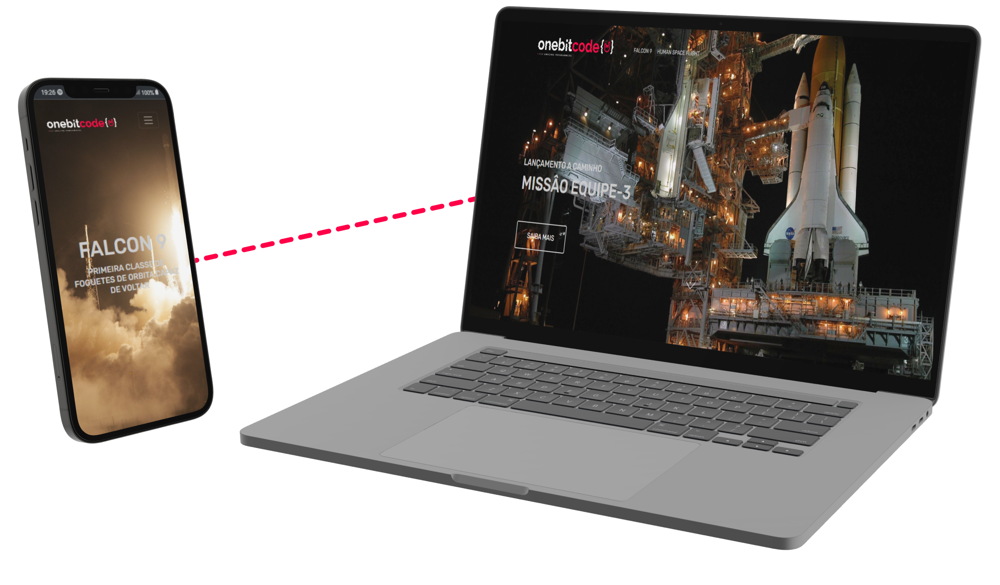

# OneBitCode - OnebitX

> Página construida usando apenas Bootstrap.

> Site construido na aula de Bootstrap da OneBitCode.

- Tabelas
- Manipulção de elementos
- Responsividade
- Animação de texto

<a href = "https://carloscunha611.github.io/oneBitX/" target = '_blank'> Clique aqui para acessar </a>

## 🛠 Tecnologias

## ✉ Contato

<a href = "https://t.me/Carloscunha611" target = '_blank'>
